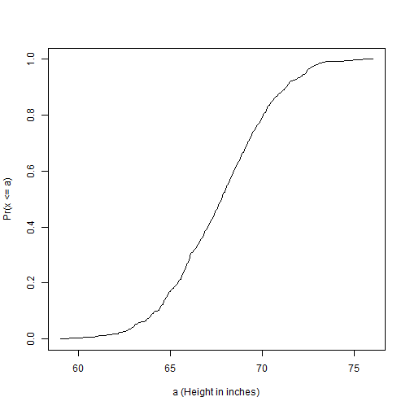
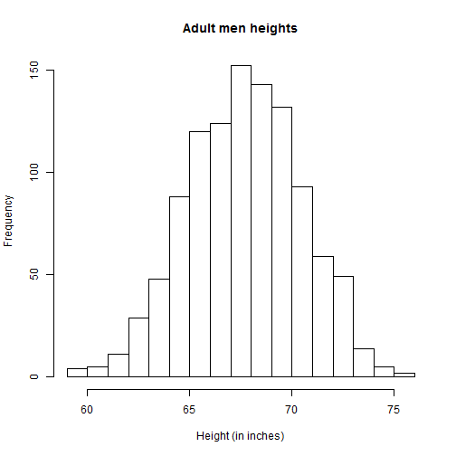
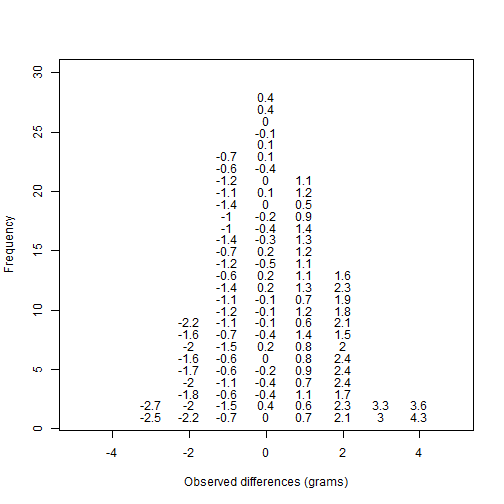
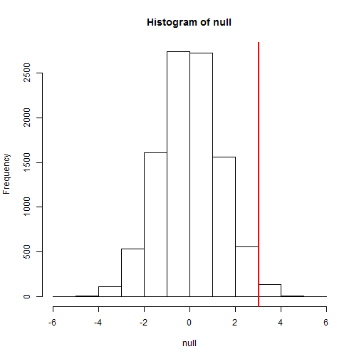
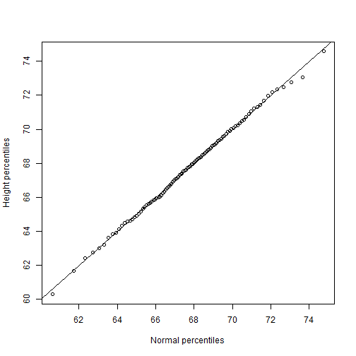
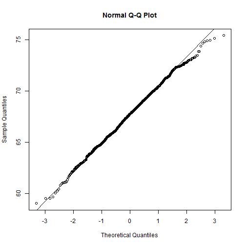
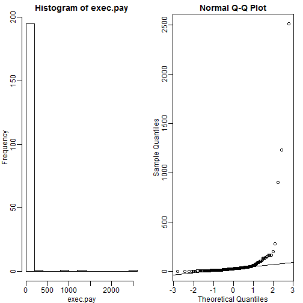
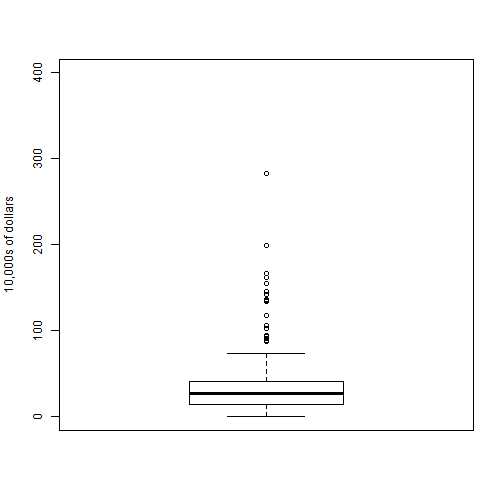
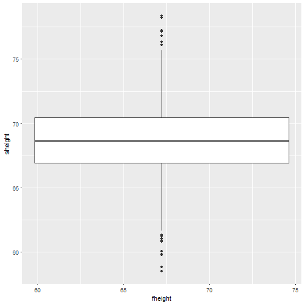
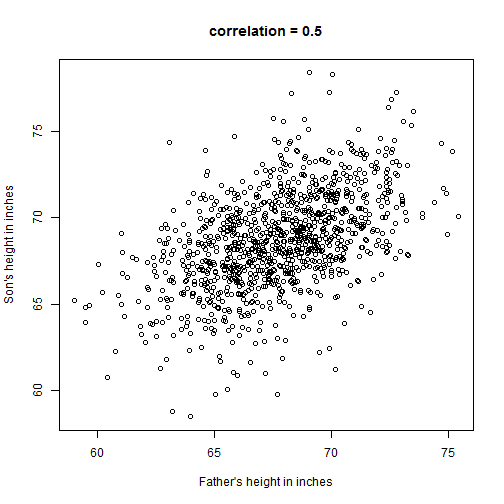

Introduction to R
========================================================
author: Dr. Caleb Kibet
date: 23/07/2018
autosize: true


Introduction to R-programming
========================================================
R is a powerful language and environment for statistical computing and graphics.

Why R?
*  Widely used statistical package
* Free to install and use
* Lots of readily available help online
* Have lots of packages tailored for domain specific statistical problems

But, may have some steep learning curve and installing packages can be a headache. 

Getting started
========================================================
To use R, we will need to have the following installed:

1. R: the statistical package
2. RStudio: The interactive development environment that will make your life easy
3. Install the packages and libraries needed

        * install.packages('packagename')


Before you start
===============================
* Create project within a folder in your computer
* Create folder for your code
* Create folder for Data
  * Raw: Downloaded or gathered from the field
  * Derived: processed through your analysis
* Create for figures generated from your analysis
* Ensure separation of information

Quick Demo
===============================================
A demo on:

* Creating a project
* setting working directory
* Creating folders

Types of Data Objects in R
===================================

**scalars:** a single number – 0 - dimensional

**vectors:** a row of numbers, also called arrays - 1 - dimensional. Verctors are the 'workhorses' of R. They are ordered group of numbers, character strings, etc. They can only have one data type. 


```r
newVector<-c(2,5,5,3,3,6,2,3,5,6,3)
newVector
```

```
 [1] 2 5 5 3 3 6 2 3 5 6 3
```

```r
scannedVector <- scan() #Reads in data from the console
```

Matrices
========

**matrices:** Data in two-dimensions organized into rows and columns, just like a table. Like vectors, they can only be of one data type. 

```r
mat<-matrix(c(2,3,1,5),nrow=2,ncol=2)
mat
```

```
     [,1] [,2]
[1,]    2    1
[2,]    3    5
```

```r
# We can also use = sign
mb = matrix(1:9, nrow=3, ncol=3)
```
#demos

DataFrames
=================
This is a versatile data object in R used to store high dimensional data, more like a spreadsheet. Allows storing of data of different data types; each column is a vector of the same data type, though.


```r
organism <- c("Human","Mouse","Fruit Fly", "Roundworm","Yeast")
genomeSizeBP <- c(3000000000,3000000000,135600000,97000000,12100000)
estGeneCount <- c(30000,30000,13061,19099,6034)

comparativeGenomeSize <- data.frame(organism=organism,genomeSizeBP=genomeSizeBP,
                                    estGeneCount=estGeneCount)
```


=====

```r
comparativeGenomeSize
```

```
   organism genomeSizeBP estGeneCount
1     Human    3.000e+09        30000
2     Mouse    3.000e+09        30000
3 Fruit Fly    1.356e+08        13061
4 Roundworm    9.700e+07        19099
5     Yeast    1.210e+07         6034
```

Component Selection
==========


```r
comparativeGenomeSize$organism
```

```
[1] Human     Mouse     Fruit Fly Roundworm Yeast    
Levels: Fruit Fly Human Mouse Roundworm Yeast
```

The $ sign is called the component selector, used to extract a part (component) of an object.

Continue learning the basics on your own
=======
Due to time limtation, we will not be able to cover all the basics. The purpose of this introduction is to pique your interest and teach you how to learn. 

Swirl: "swirl teaches you R programming and data science interactively, at your own pace, and right in the R console!"

# ```{r}
# library(swirl)
# swirl()
# ```
Getting Help
==========


```r
#help("seq")
#?seq
```

Are High fat fed mice heavier?
=========================================================
We'll learn the rest of the concepts by reproducing the analysis from this [paper](http://diabetes.diabetesjournals.org/content/53/suppl_3/S215.full)


```r
dat <- read.csv("D:/Teaching_R/Data/femaleMiceWeights.csv")

control <- dat[ dat$Diet == 'chow', colnames(dat)=='Bodyweight']

treatment <- dat[ dat$Diet == 'hf', colnames(dat)=='Bodyweight']
print( mean(treatment) )
```

```
[1] 26.83417
```

```r
print( mean(control) )
```

```
[1] 23.81333
```

=====================================================
What is the observed difference?

```r
obsdiff <- mean(treatment) - mean(control)
print(obsdiff)
```

```
[1] 3.020833
```
This is a random variable; repeating the experiment gives different mean.

Random Variables
======================================================
Lets use the control population data to explore random variables further.


```r
population <- read.csv("D:/Teaching_R/Data/femaleControlsPopulation.csv")
population <- unlist(population) # turn it into a numeric
```

Let's sample 12 mice and see how the mean varies.


```r
control <- sample(population,12)
mean(control)
```

```
[1] 22.5375
```

========================================================
Sampling a few more times gives us the following means:


```r
control <- sample(population,12)
mean(control)
```

```
[1] 24.44167
```

```r
control <- sample(population,12)
mean(control)
```

```
[1] 24.01333
```

NB:You may get different results, since this is random sampling.

The Null Hypothesis
========================================================

```r
n <- 10000
null <- vector("numeric",n)
for (i in 1:n) {
  control <- sample(population,12)
  treatment <- sample(population,12)
  null[i] <- mean(treatment) - mean(control)
}

mean(null >= obsdiff)
```

```
[1] 0.0146
```
This shows the observed difference is seen at random 1.3% of the time. This is the p-value


Distribution
========================================================

We'll use the following data to demonstrate this concept

```r
library(UsingR)
x <- father.son$fheight
```
We can visualize distribution of raw data


```r
round(sample(x,10),1)
```

```
 [1] 70.1 65.6 69.0 62.5 68.2 65.7 72.4 69.9 66.1 65.9
```

But, this is hard to see

Cumulative distribution function
======================================================

```r
smallest <- floor( min(x) )
largest <- ceiling( max(x) )
values <- seq(smallest, largest,len=300)
heightecdf <- ecdf(x)
```


======================================================
We get the following plot:

```r
plot(values, heightecdf(values), type="l",
     xlab="a (Height in inches)",ylab="Pr(x <= a)")
```



Histogram
=======================================================

```r
bins <- seq(smallest, largest)
hist(x,breaks=bins,xlab="Height (in inches)",main="Adult men heights")
```


May be better.

Probability Distribution
=======================================================

```r
n <- 100
library(rafalib)
nullplot(-5,5,1,30, xlab="Observed differences (grams)", ylab="Frequency")
totals <- vector("numeric",11)
for (i in 1:n) {
  control <- sample(population,12)
  treatment <- sample(population,12)
  nulldiff <- mean(treatment) - mean(control)
  j <- pmax(pmin(round(nulldiff)+6,11),1)
  totals[j] <- totals[j]+1
  text(j-6,totals[j],pch=15,round(nulldiff,1))
##if(i < 15) Sys.sleep(1) ##You can add this line to see values appear slowly
}
```




======================================================


```r
hist(null, freq=TRUE)
abline(v=obsdiff, col="red", lwd=2)
```



Normal Distribution
========================================================

```r
1 - pnorm(obsdiff,mean(null),sd(null))
```

```
[1] 0.01263571
```


t-test
====================


```r
control <- dat[ dat$Diet == 'chow', colnames(dat)=='Bodyweight']

treatment <- dat[ dat$Diet == 'hf', colnames(dat)=='Bodyweight']

result <- t.test(treatment,control)
result$p.value
```

```
[1] 0.05299888
```

Explolatory Data Analysis and Visualization
=========


Plots: Quantile Quantile Plots
================
It is a plot of the quantiles of the first data set against the quantiles of the second data set. Used to check if data comes from a theoritical distribution. 

```r
library(UsingR) ##available from CRAN
library(rafalib)
x <- father.son$fheight
ps <- ( seq(0,99) + 0.5 )/100
qs <- quantile(x, ps)
normalqs <- qnorm(ps, mean(x), popsd(x))
```

======

```r
plot(normalqs,qs,xlab="Normal percentiles",ylab="Height percentiles")
abline(0,1) ##identity
```



But we can get the same plot by:
======

```r
qqnorm(x)
qqline(x)
```



This plots against the standard normal.

Boxplots
=============
When the data is not normally distributed, the standard deviation and mean are not always informative.


====

```r
mypar(1,2)
hist(exec.pay) ##in UsingR package
qqnorm(exec.pay)
qqline(exec.pay)
```




Explaining Box plot
=====


=========

```r
boxplot(exec.pay, ylab="10,000s of dollars", ylim=c(0,400))
```



=========

```r
ggplot(data = father.son, aes(x = fheight, y = sheight)) +
    geom_boxplot()
```



Scatterplots And Correlation
====
Used to visualize the relationship between two numerical variables.


=======

```r
library(UsingR)
data("father.son")
x=father.son$fheight
y=father.son$sheight
```

=======

```r
plot(x,y,xlab="Father's height in inches",ylab="Son's height in inches",main=paste("correlation =",signif(cor(x,y),2)))
```




A good graphic
=========
A good graphic should inform and provide information about the data accurately and clearly. It should follow these principles:
-  Be accurate and clear.
- Let the data speak.
- Show as much information as possible, taking care not to obscure the message.
- Science not sales: avoid unnecessary frills (esp. gratuitous 3D).
- In tables, every digit should be meaningful. Don’t drop ending 0’s.


However, it should not:
=========
- Display as little information as possible.
- Obscure what you do show (with chart junk).
- Use pseudo-3D and color gratuitously.
- Make a pie chart (preferably in color and 3D).
- Use a poorly chosen scale.
- Ignore significant figures

