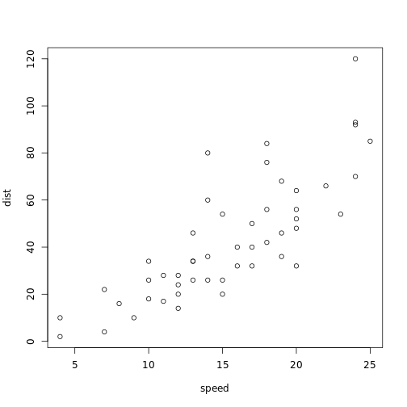

Reproducible Research in RStudio
========================================================
author: Caleb Kibet
date: 01 August, 2018
autosize: true

Introduction to Reproducibility
========================================================
Introduce research reproducibility here


Tips for Reproducible Research
================================
1. Document everything!
2. Everything is a (text) file.
3. All files should be human readable.
3. Explicitly tie your files together.
5. Have a plan to organize, store, and make your files available.

Project Folders
================================
- Choose a file structure that works for you
- It is good practice to use relative paths when possible and organize your
files such that using relative paths is easy. Makes paths less dependent on particular File or OS structure.
- Always avoid putting spaces in your file and directory
names
- Each project must have a README.md that describes the purpose and structure of your project

Before you start
===============================
* Create project within a folder in your computer
* Create folder for your code
* Create folder for Data
  * Raw: Downloaded or gathered from the field
  * Derived: processed through your analysis

======================
* Create a folder for figures generated from your analysis
* NB: Ensure separation of information


Literate Programming
====================
Literate programming is a crucial part of a reproducible quantitative research. Being able to directly link your analyses, your results, and the code you used to produce the results makes tracing your steps much easier.


Quick Demo
===============================================
A demo on:

* Creating a project
* setting working directory
* Creating folders


Slide With Code
========================================================


```r
summary(cars)
```

```
     speed           dist       
 Min.   : 4.0   Min.   :  2.00  
 1st Qu.:12.0   1st Qu.: 26.00  
 Median :15.0   Median : 36.00  
 Mean   :15.4   Mean   : 42.98  
 3rd Qu.:19.0   3rd Qu.: 56.00  
 Max.   :25.0   Max.   :120.00  
```

Slide With Plot
========================================================




Reference Text
===================
1. [Reproducible Research with R and RStudio Second Edition](https://englianhu.files.wordpress.com/2016/01/reproducible-research-with-r-and-studio-2nd-edition.pdf) is a great reference text.
2. https://rmarkdown.rstudio.com/lesson-11.html
3. https://rmarkdown.rstudio.com/articles_intro.html
